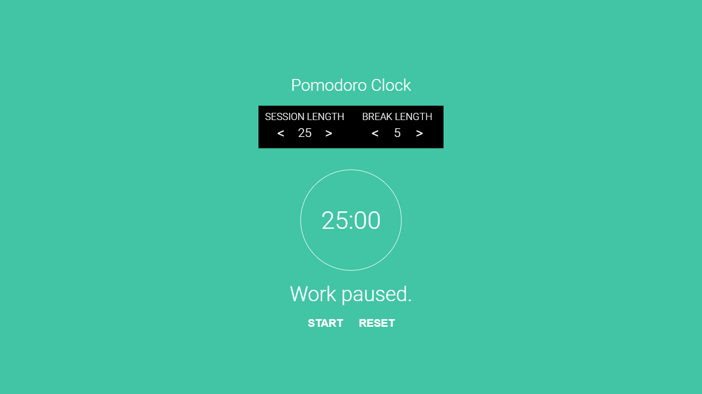

# Pomodoro Clock

This project is part of the freeCodeCamp [Front End Libraries Projects](https://learn.freecodecamp.org/front-end-libraries/front-end-libraries-projects/build-a-pomodoro-clock). The design is inspired by Patryk Sobczak's pomodoro app design on [dribbble](https://dribbble.com/shots/1224911-pomodoro-app).



## Tech used

Build with [React](https://reactjs.org/) using [Create React App](https://github.com/facebook/create-react-app).

## How to use

Clone this repo:

``` 
git clone https://github.com/huxinsen/pomodoro-clock.git
```

Install all dependancies:

``` 
npm install
```

Start the server:

``` 
npm start
```

